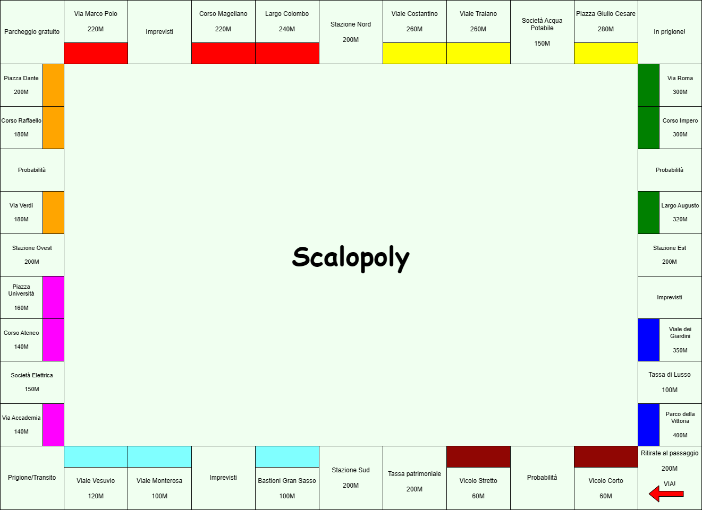

# Introduzione
L'obiettivo del progetto è quello di realizzare una propria implementazione di Monopoly, un famoso gioco da tavolo di strategia ed economia che simula l'esperienza di essere un imprenditore immobiliare.

Il tabellone di gioco di Monopoly è suddiviso in una griglia di caselle che rappresentano le proprietà immobiliari, le stazioni ferroviarie, le compagnie di servizi pubblici e le caselle di eventi speciali. Ogni giocatore inizia con una determinata quantità di denaro e l'obiettivo del gioco è accumulare ricchezza, acquistando, affittando e sviluppando proprietà, e rimanere l'ultimo in partita, mandando gli altri giocatori in bancarotta.

Il gioco si svolge attraverso il lancio di 2 dadi, che determinano il movimento dei giocatori lungo il tabellone. Quando un giocatore atterra su una proprietà non ancora posseduta, può acquistarla all'asta o passare. Se decide di acquistarla, diventa il proprietario e può iniziare a riscuotere affitti dagli altri giocatori che atterrano su quella casella.

Il cuore del gioco risiede nella strategia finanziaria. I giocatori possono costruire case e alberghi sulle loro proprietà per aumentare il costo degli affitti. Tuttavia, bisogna stare attenti alle tasse, alle carte di "Probabilità" e "Imprevisti" e alle caselle "Prigione" che possono rallentare il progresso.

Il tabellone utilizzato nella realizzazione di questa versione di Monopoly, si può vedere nella figura sotto riportata.

[Torna alla Home](../README.md) | [Vai a Metodologia di Sviluppo](../2-development-process/README.md)
