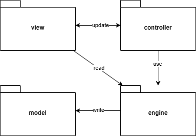

# Design architetturale
Una volta definiti i requisiti, e tenuto conto del tipo di progetto (un gioco con GUI), si è scelto di utilizzare il pattern MVC (Model-View-Controller) per la progettazione e la successiva realizzazione. Grazie a questo pattern è stato possibile separare chiaramente le diverse responsabilità all'interno dell'applicazione tra i vari componenti.

## Utilizzo di MVC
Nella figura sottostante è riportato una diagramma di alto livello che mostra il sistema implementato tramite pattern MVC.

  

Come si può vedere i componenti utilizzati non sono 3 ma 4:
- **Model**: al suo interno si trovano tutte le entità che modellano il dominio del gioco;
- **View**: al suo interno si trovano i file che gestiscono le varie interfacce grafiche grazie alle quali è possibile interagire con il sistema e giocare;
- **Controller**: ad ogni view è associato il rispettivo controller che le permette di interagire con il model attravero l'utilizzo di vari engine
- **Engine**: questo modulo aggiuntivo è costituito da un insieme di engine che facilitano l'interazione con il model. Senza di essi, i controller agirebbero su diverse entità del modello in modo disorganizzato e poco comprensibile. L'uso degli engine consente di indirizzare queste interazioni direttamente verso di essi, sono numericamente inferiori rispetto alle entità del model, riducendo quindi gli entry point verso il model stesso.

[Indietro](../3-requirements/README.md) | [Torna alla Home](../README.md) | [Vai a Design di dettaglio](../5-detailed-design/README.md)
