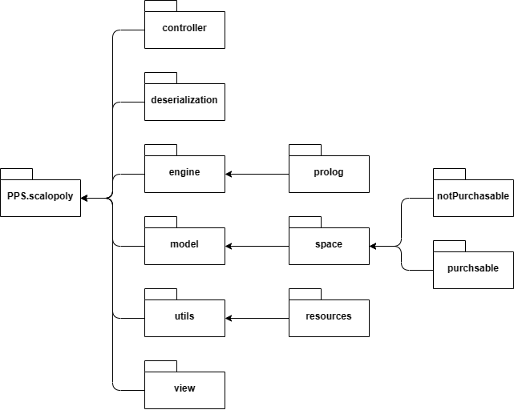
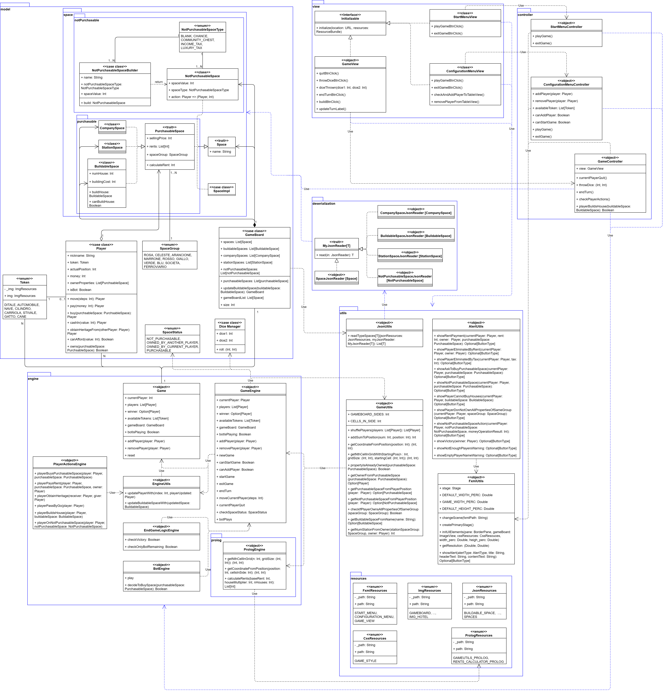
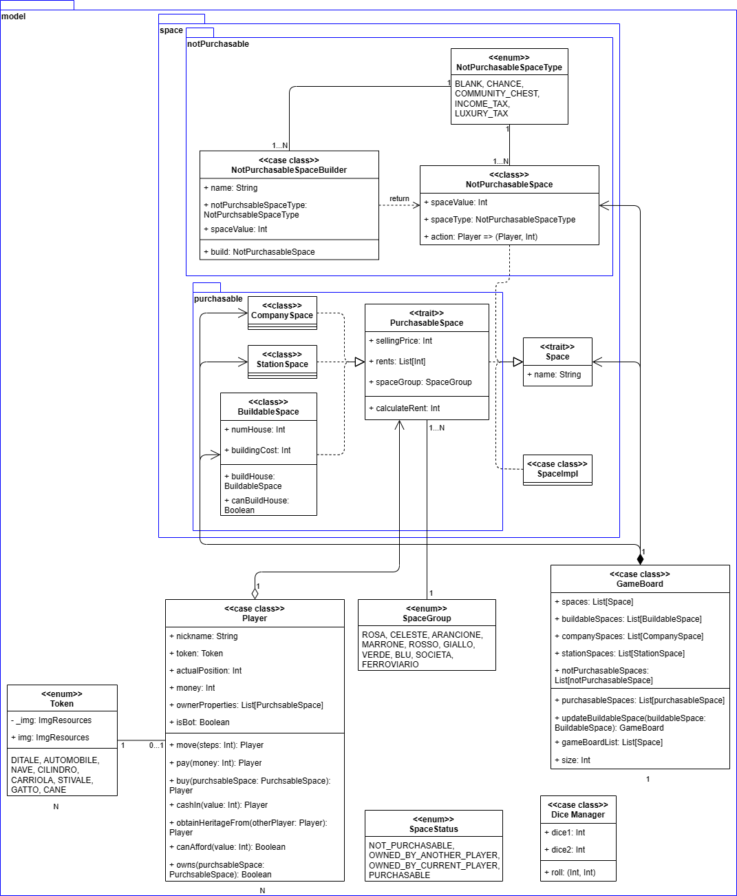
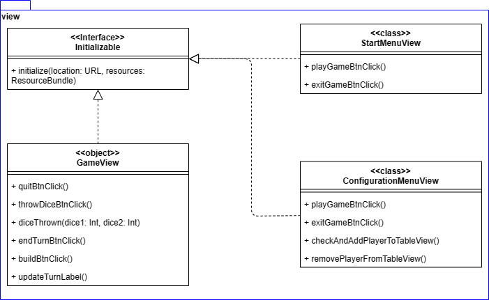
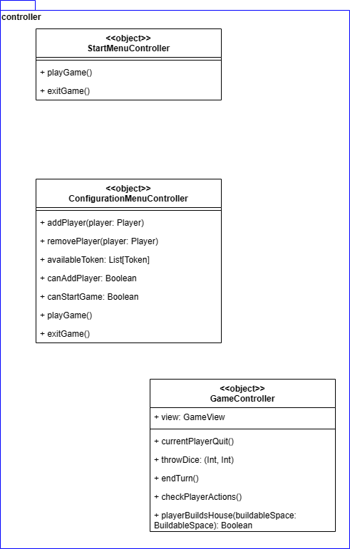
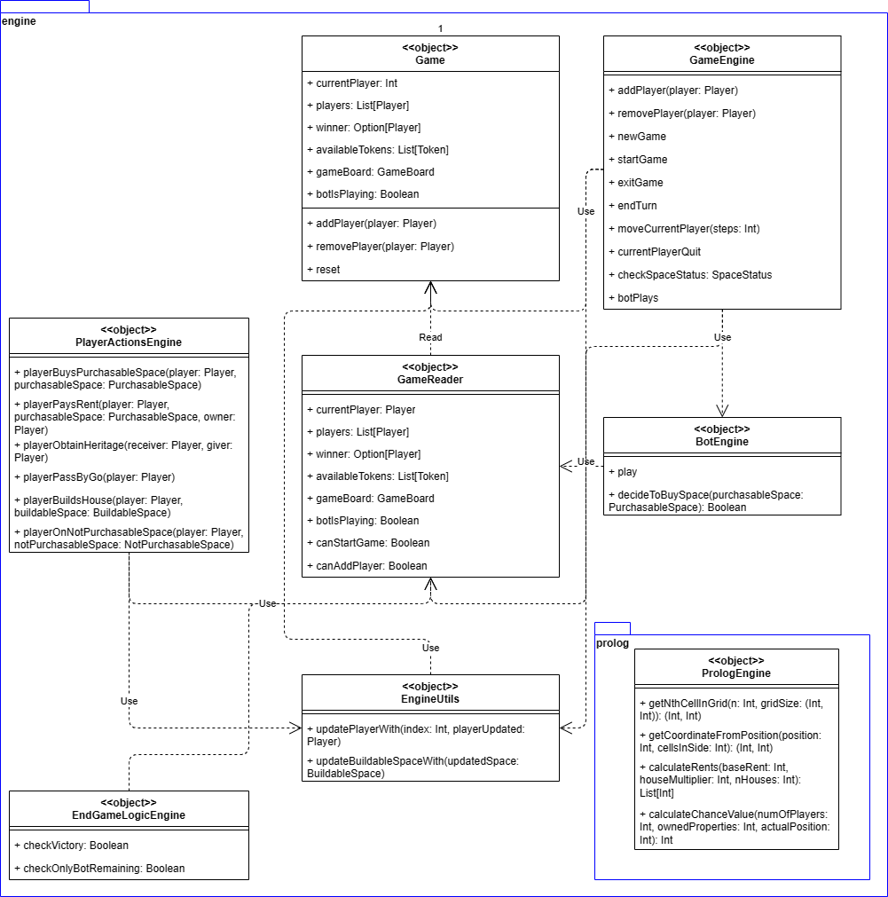
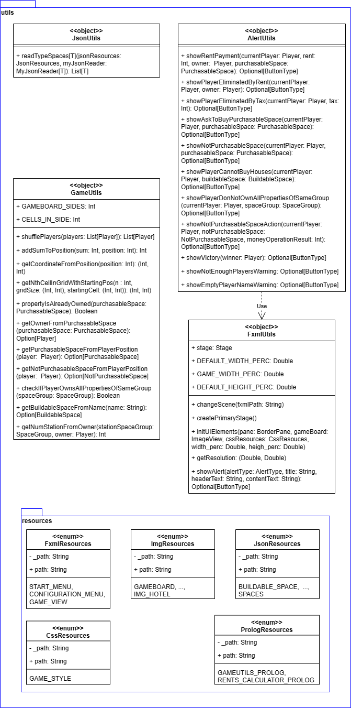
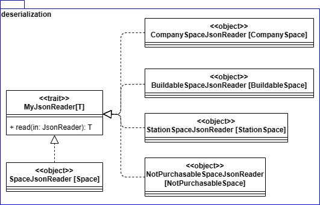

# Design di dettaglio

Come detto nel capitolo precedente le componenti del sistema sono state suddivise in vari moduli; oltre a quelli già citati (alcuni dei quali sono stati a loro volta divisi in sotto-moduli) sono presenti 2 ulteriori package, uno per la deserializzazione di file json contenenti informazioni delle varie caselle del tabellone di gioco, e uno contenente vari oggetti di utility. 

Nella figura sottostante viene mostrata la gerarchia con cui sono stati organizzati i vari moduli del progetto.

  

## Diagramma delle Classi
Nella figura sottostante è riportato il diagramma delle classi. I rettangoli blu indicano i vari moduli e sotto-moduli.

  

Viene ora analizzato ogni singolo modulo.

## Model
In figura viene mostrato il modulo `Model` con i relativi sotto-moduli, `Space`, `NotPurchasable` e `Purchasable`.

  

### Space
Nel modulo space sono state implementate le logiche di cella della GameBoard definite dal trait Space poi specializzato da SpaceImpl, NotPurchasableSpace e da PurchasableSpace.

#### NotPurchasable
In questo sotto modulo sono state implementate le caselle non acquistabili nel gioco.
Queste celle sono poi differenziante in base al tipo NotPurcasableSpaceType nel seguente modo:
* BLANK: cella non definita,
* CHANCE: Possibilità,
* COMMUNITY_CHEST: Imprevisti,
* INCOME_TAX: Tassa patrimoniale,
* LUXURY_TAX: Tassa di lusso.
  
La classe NotPurchasableSpace è uno Space che rappresenta una casella non acquistabile dai giocatori ed composta da:
* un parametro spaceValue che rappresenta il valore utilizzato nell'azione della casella,
* un parametro spaceType di tipo NotPurcasableSpaceType,
* un parametro action che rappresenta un metodo che dato un Player esegue un'azione su di esso.

La classe NotPurchasableSpaceBuilder si occupa infine di instanziare questi tipi di classe in base al name e allo spaceType il quale va a pilotare anche la action definita.

#### Purchasable
In questo sotto modulo sono state implementate le caselle acquistabili nel gioco.
Il trait PurchableSpace è uno Space che rappresenta una casella acquistabile dai giocatori ed è compsta da:
* un parametro sellingPrice che indica il prezzo di vendita della casella,
* un parametro rents che inidica gli affitti che i giocatorri pagheranno al passaggio della casella in base al numero di case presenti in essa, questo se la cella appartiene ad un altro giocatore,
* un parametro spaceGroup che indica il gruppo di appartenenza della cella.

Il trait PurchableSpace è implementato dalle classi:
* CompanySpace e StationSpace in cui è definita una specifica logica di calcolo del pedaggio (implementata nel calculateRent),
* BuildableSpace che rappresenta il restto delle caselle acquistabili dove è possibile costruire case (definite da numHouse) e alberghi pagando il buildingCost.

## View
In figura viene mostrato il modulo View.

  

In questo modulo sono state implementate le viste rispettando il pattern MVC per permettere quindi un'interazione tra il giocatore e il controller che effettuerà poi le varie azioni.
Questo modulo è composto dalle 3 viste che è possibile incontrare nel gioco ed ereditano tutte dall'interfaccia javafx.fxml.Initializable:
* StartMenuView: rappresenta la vista di avvio in cui ci sono i tasti per avviare il gioco (playGameBtnClick) o per terminarlo (exitGameBtnClick),
* ConfigurationMenuView: rappresenta la vista la vista di configurazione per impostare i giocatori e sono presenti i comandi per avviare il gioco (playGameBtnClick), terminare il gioco (exitGameBtnClick), verificare e validare l'inserimento di un nuovo giocatore (checkAndAddPlayerToTableView) ed infine per rimuovere un giocatore dall'elenco di quelli già aggiunti (removePlayerFromTableView),
* GameView: rappresenta la vista di gioco dove sono presenti i comandi per permettere ad un giocatore di abbandonare il gioco (quitBtnClick), lanciare i dadi (throwDiceBtnClick), di aggiornare la vista a seguito del lancio dei dadi (diceThrown), per permettere al giocatore di terminare il turno (endTurnBtnClick), di costruire una casa (buildBtnClick), aggiornare la vista mostrando il nome del giocatore di turno (updateTurnLabel).

## Controller
In figura viene mostrato il modulo Controller.

  

In questo modulo Controller sono state implementate le logiche di interazione tra Vista e Modello rispettando il pattern MVC attraverso le seguenti classi:
* StartMenuController: si occupa di comunicare con la vista iniziale StartMenuView esponendo i comandi playGame per passare alla schermata di configurazione ConfigurationMenuView, e exitGame per terminare il gioco,
* ConfigurationMenuController: si occupa di comunicare con la vista di configurazione ConfigurationMenuView attra verso i metodi addPlayer (per aggiungere un nuovo giocatore), removePlayer (per rimuoverne uno), availableToken (che restituisce la lista dei token ancora utilizzabili per i nuovi gioccatori), cadAddPlayer e canStartPlay che verificano se è possibile aggiungere ancora giocatori e se è possibile avviare la partita (questi utilizzati per pilotare la visibilità di alcuni campi nella vista) ed infine playGame (per avviare il gioco e spostarsi nella vista GameView) e exitGame (per terminare il gioco,
* GameController: si occupa di comunicare con la vista GameView di cui mantiene un riferimenti nella variabile view. È composto dai metodi currentPlayerQuit (che viene invocato quando un giocatore decide di abbandonare), throwDice (invocato quando un giocatore lancia i dadi), endTurn (chiamato quando un giocatore termina il proprio turno), checkPlayerActions (per verificare quali azioni può fare li giocatore) ed infine playerBuildHouse (che prende in ingresso il BuildableSpace dove il giocatore vuole costruire e restituisce un booleano che indica se l'operazione è stata completata con successo o meno). 

## Engine
In figura viene mostrato il modulo Engine che contiene le varie parti che gestiscono le logiche di gioco.

  

### GameEngine
Si tratta dell'engine che gestisce tutte le varie logiche di gioco e che si interfaccia con gli altri moduli esterni al modulo Engine:
* addPlayer: metodo per aggiungere un giocatore al Game,
* removePlayer: metodo per rimuovere un giocatore al Game,
* newGame: metodo per creare un nuovo gioco,
* startGame: metodo per avviare un nuovo gioco,
* exitGame: metodo per chiudere l'applicativo,
* endTurn: metodo per terminare il turno del giocatore corrente,
* moveCurrentPlayer: metodo per spostare il giocatore corrente,
* currentPlayerQuit: metodo per gestire l'abbandono di un giocatore,
* checkSpaceStatus: metodo per verificare lo stato della casella su cui si è fermato il giocatore corrente,
* botPlays: indica se sta giocando il giocatore Bot.

### Game
Questo object rappresenta il modello del Game accessibile solamente dal pacchetto Engine, viene richiamato e modificato dal GameEngine e dall'EndgameLogicEngine:
* currentPlayer: indica il giocatore corrente,
* players: indica la lista dei giocatori,
* winner: indica il vincitore del gioco quando presente,
* availableTokens: indica i Token dei giocatori non ancora utilizzati,
* gameBoard: rappresenta la GameBoard di gioco,
* botIsPlaying: indica se sta giocando il giocatore Bot,
* addPlayer: metodo per aggiungere un giocatore al Game,
* removePlayer: metodo er rimuovere un giocatore al Game,
* reset: per ripristinare il Game allo stato iniziale.

### GameReader
Questo object rappresenta un Reader per permettere di consultare i dati di gioco dai moduli che non devono aver accesso a modifiche su quest'ultimo (come ad esempio le viste):
* currentPlayer: indica il giocatore corrente,
* players: indica la lista dei giocatori,
* winner: indica il vincitore del gioco quando presente,
* availableTokens: indica i Token dei giocatori non ancora utilizzati,
* gameBoard: rappresenta la GameBoard di gioco,
* botIsPlaying: indica se sta giocando il giocatore Bot,
* canStartGame: specifica se è possibile avviare il gioco, 
* canAddPlayer: specifica se è possibile aggiungere un giocatore.

### EngineUtils
Questo object racchiude alcuni strumenti utili per i vari Engine:
* updatePlayerWith: permette di aggiornare un giocatore in base all'indice fornito,
* updateBuildableSpacesWith: aggiorna la GameBoard fornito il suo BuildableSpace.

### PlayerActionEngine
Questo object gestisce le logiche di gioco legame alle azioni dei giocatori:
* playerBuysPurchasableSpace: gestisce l'acquisto di una casella acquistabile da parte di un giocatore,
* playerPaysRent: gestisce il pagamento dell'affitto di un giocatore che passa su una casella che appartiene ad un altro giocatore,
* playerObtainHeritage: gestisce l'eredità ricevuta da un giocatore da parte di un altro giocatore,
* playerPassByGo: gestisce il passaggio dal via di un giocatore,
* playerBuildsHouse: gestisce la costruzione di una casa su una casella dove è possibile costruire,
* playerOnNotPurchasableSpace: gestisce l'azione su un giocatore che si trova su una casella non acquistabile.

### EndGameLogicEngine
Questo object gestisce le logiche di fine gioco, verifica se è presente un vincitore e in quel caso lo imposta sul Game:
* checkVictory: verifica se il giocatore corrente ha vinto il gioco,
* checkOnlyBotsRemaining: verifica se l'ultimo giocatore rimasto è il giocatore bot.

### BotEngine
Questo object è responsabile delle azioni del giocatore bot.
* play: metodo che fa partire il turno del bot,
* decideToBuySpace: metodo che decide se il bot acquisterà la casella acquistabile.

### PrologEngine
Questo object è responsabile della gestione delle funzionalità sviluppate in Prolog:
* getNthCellInGrid: restituisce le coordinate dell'n-essima cella della griglia della dimensione specificata,
* getCoordinateFromPosition: restituisce le coordinate di una cella della griglia data la poszione del gicaotre sulla GameBoard,
* calculateRents: restituisce la lista degli affitti di una proprietà dato un moltiplicatore e il numero di case su tale proprietà,
* calculateChanceValue: restituisce un interno tra 0 e 1 per permettere poi di definire se far pagare o dare soldi al giocatore che subisce l'azione della casella Probabilità

## Utils
In figura viene mostrato il modulo di strumenti utilizzati nell'applicativo.

  

Il modulo Utils contiene le varie classi implementate per fornire gli strumenti necessari a compiere operazioni che si ripetevano all'interno del programma.

### UI
Lato UI si è reso necessario creare FxmlUtils per integrare ed utilizzare le librerie grafiche javafx e scalafx.
L'object FxmlUtils contiente:
* un'istanza dello Stage di ScalaFx necessario per mostrare lo stage della UI,
* dei valori fissi (DEFAULT_WIDTH_PERC, DEFAULT_HEIGHT_PERC, GAME_WIDTH_PERC) che indicano la percentuale di altezza/larghezza di alcuni elementi rispetto al finestra globale dell'applicativo,
* il metodo changeScene utilizzato per passare da una scena del gioco ad un'altra,
* il metodo createPrimaryStage che inizializza l'istanza di stage definita sopra,
* initUIElements che si occupa di inizializzare i vari elementi della UI,
* getResolution che si occupa di recuperare la risoluzione dello schermo in cui l'applicativo parte,
* showAlert che permette di mostrate una finestra per notificare al giocatore un messaggio.
  
Sempre lato UI è stato poi necessario creare un AlertUtils per definire i vari Alert mostrati durante il gioco utilizzando le funzionalità di FxmlUtils, di seguito una breve spiegazione dei vari metodi utilizzabili i quali fanno tutti uso di showAlrt definito in FxmlUtils appena visto:
* showRentPayment: permette di segnalare al giocatore corrente che pagherà un affitto in quanto è arrivato su una casella posseduta da un altro giocatore,
* showPlayerEliminaterByRent: permette di segnalare al giocatore corrente che è stato sconfitto in quanto non ha abbastanza denaro per pagare un affitto,
* showPlayerEliminatedByTax: permette di segnalare al giocatore corrente che è stato sconfitto in quanto non ha abbastanza denaro per pagare una tassa,
* showAskToBuyPurchasableSpace: permette di chiedere al giocatore corrente se vuole acquistare una casella libera su cui è arrivato,
* showNotPurchasableSpace: permette di segnalare al giocatore corrente che non possiede abbastanza denaro per acquistare la casella su cui è arrivato,
* showPlayerCannotBuyHouse: permette di segnalare al giocatore che non possiede abbastanza denaro per acuistare una casa,
* showPlayerDonNotOwnAllPropertiesOfSameGroup: permette di segnalare al giocatore che non può acuistare una casa in una sua proprietà perchè non possiede tutte le caselle dello stesso SpaceGroup,
* showNotPurchasableSpaceAction: permette di segnalare al giocatore l'azione della casella non acquistabile che subirà,
* showVictory: permette di segnalare al giocatore che ha vinto la partita,
* showNotEnoughPlayersWarning: permette di segnalare che non ci sono abbastanza giocatore per iniziare la partita,
* showEmptyPlayerNameWarning: permette di segnalare che non è possibile aggiungere un giocatore con nome vuoto.

### Deserialization
Abbiamo creato l'object JsonUtils per deifnire il metodo readTypeSpaces parametrizzato sul tipo T che permette di deserializzare gli Space da un file Json restituendo una lista degli stessi.

### Game
Abbiamo ritenuto necessario creare l'object GameUtils per centralizzare le operazioni necessarie al calcolo delle operazioni di gioco:
* GAMEBOARD_SIDES è una costante che indica il numero di lati della GAMEBOARD,
* CELLS_IN_SIDE è una costante che indica il numero di caselle per lato,
Tali costanti sono state necessarie in quanto tali valori sono utilizzati in vari punti e quindi sono stati identificati come magic numbers e isolati.
* shufflePlayers: mischia una lista di Player per modificarne l'ordine,
* addSumToPosition: restituisce la nuova posizione di un giocatore a seguito di un lancio di dadi,
* getCoordinateFromPosition: restituisce le coordinate di una cella data la posizione del giocatore sulla GameBoard,
* getNthCellInGridWithStartingPos: restituisce l'n-esima cella della griglia passata a partire dalla cella di partenza fornita,
* propertyIsAlreadyOwned: verifica se una proprietà appartiene già ad un altro giocatore,
* getOwnerFromPurchasableSpace: restituisce il proprietario di una casella acquistabile se tale casella è stata acquistata,
* getPurchasableSpaceFromPlayerPosition: restituisce la casella acquistabile su cui è il giocatore, nel caso sia su una casella acquistabile,
* getNotPurchasableSpaceFromPlayerPosition: restituisce la casella non acquistabile su cui è il giocatore, nel caso sia su una casella non acquistabile,
* checkIfPlayerOwnsAllPropertiesOfSameGroup: verifica se il giocatore possiede tutte le caselle di uno stesso SpaceGroup,
* getBuildableSpaceFromName: restituisce un BuildableSpace dato il suo nome,
* getNumStationFromOwner: restituisce il numero di stazioni possedute dal giocatore dello stesso SpaceGroup della stazione su cui si è fermato.

### Resources
Abbiamo raccolto le varie risorse dell'appliatico in alcuni enum per una loro gestione programmatica:
* FxmlResources: raccoglie tutte le risorse di tipo fxml utilizzate nell'applicativo,
* ImgResources: raccoglie tutte le risorse di tipo immagine utilizzate nell'applicativo,
* JsonResources: raccoglie tutte le risorse di tipo JSON utilizzate nell'applicativo,
* CssResources: raccoglie tutte le risorse di tipo css utilizzate nell'applicativo,
* PrologResources: raccoglie tutte le risorse di tipo pl (file prolog) utilizzate nell'applicativo.

## Deserialization
In figura viene mostrato il modulo di deserializzazione dei dati applicativi.

  

Il trait MyJsonReader definisce un generico JsonReader con il rispettivo comando read che prende in ingresso il JsonReader da analizzare.
Tale trai è implementato dagli altri 5 Object come si vede nella figura:
* SpaceJsonReader: si occupa di deserializzare oggetti Space,
* StationSpaceJsonReader: si occupa di deserializzare oggetti StationSpace,
* NotPurchasableSpaceJsonReader: si occupa di deserializzare oggetti NotPurchasableSpace,
* CompanySpaceJsonReader: si occupa di deserializzare oggetti CompanySpace,
* BuildableSpaceJsonReader: si occupa di deserializzare oggetti BuildableSpace.

I vari Json sono nella cartella di progetto  app/src/resources/json.

[Indietro](../4-architectural-design/README.md) | [Torna alla Home](../README.md) | [Vai a Implementazione](../6-implementation/README.md)
