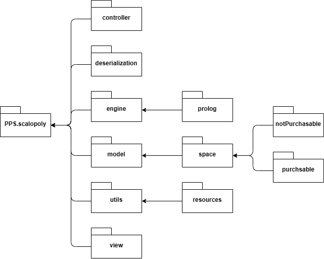

# Design di dettaglio

Come detto nel capitolo precedente le componenti del sistema sono state suddivise in vari moduli; oltre a quelli già citati (alcuni dei quali sono stati a loro volta divisi in sotto-moduli) sono presenti 2 ulteriori package, uno per la deserializzazione di file json contenenti informazioni delle varie caselle del tabellone di gioco, e uno contenente vari oggetti di utility. 

Nella figura sottostante viene mostrata la gerarchia con cui sono stati organizzati i vari moduli del progetto.

  

## Diagramma delle Classi
Nella figura sottostante è riportato il diagramma delle classi. I rettangoli blu indicano i vari moduli e sotto-moduli.

  

Viene ora analizzato ogni singolo modulo.

## Model
In figura viene mostrato il modulo *Model* con i relativi sotto-moduli, *Space*, *NotPurchasable* e *Purchasable*.

  

All'interno di *Model* sono state implementate le varie entità rappresentanti i diversi elementi del dominio:
- `Player`: rappresenta un giocatore e le sue caratteristiche, in particolare:
  -  *nickname*: il nome scelto;
  -  *token*: la pedina scelta;
  -  *actualPosition*: la posizione attuale del giocatore sul tabellone (compresa tra 0 e 39);
  -  *money*: il quantitativo di soldi attualmente posseduti dal giocatore (default 2000);
  -  *ownedProperties*: la lista delle proprietà possedute dal giocatore (di default è vuota);
  -  *isBot*: necessario a verificare se il giocatore è un bot oppure no;
- `Token`: enum contenente le varie pedine di gioco. Ad ognuna di esse è associata una *imgResources* che consente di recuperare l'immagine della pedina da mostrare poi sul tabellone;
- `SpaceGroup`: enum contenente i vari colori/valori con cui sono raggruppate le diverse proprietà;
- `SpaceStatus`: enum contenente i diversi stati che può assumere una casella:
  - *NOT_PURCHASABLE*: la casella non è acquistabile (es. Probabilità, Imprevisti, ...);
  - *OWNED_BY_ANOTHER_PLAYER*: la cella contiene una proprietà e questa è di un altro giocatore, il giocatore attuale dovrà quindi pagare l'affitto al proprietario;
  - *OWNED_BY_CURRENT_PLAYER*: la cella contiene una proprietà e questa è del giocatore attuale, non succede nulla;
  - *PURCHASABLE*: la cella contiene una proprietà e questa non appartiene a nessuno, il giocatore attuale può decidere se comprarla se ha abbastanza soldi;
- `DiceManager`: gestore dei dadi, consente di generare casualmente 2 numeri ognuno compreso tra 1 e 6;
- `GameBoard`: rappresenta il tabellone di gioco, composto da 40 caselle. La lista ordinata delle caselle viene salvata in *spaces*, mentre negli altri 4 attributi vengono raggruppate in base al loro tipo:
  - *buildableSpaces*: lista delle proprietà su cui è possibile costruire. Quando viene costruita una casa o un albergo su una di esse, essa viene aggiornata tramite il metodo *updateBuildableSpace*;
  - *companySpaces*: lista delle società;
  - *stationSpaces*: lista delle stazioni;
  - *notPurchasableSpaces*: lista delle caselle non acquistabili con i relativi effetti;
`SpaceStatus` e `DiceManager` vengono utilizzati direttamente dagli engine.

### Space
Nel modulo *Space* sono state implementate le logiche di cella della `GameBoard` definite dal trait `Space` poi specializzato da `SpaceImpl`, `NotPurchasableSpace` e da `PurchasableSpace`.

#### NotPurchasable
In questo sotto modulo sono state implementate le caselle non acquistabili nel gioco.
Queste celle sono poi differenziante in base al tipo `NotPurcasableSpaceType` nel seguente modo:
* *BLANK*: cella non definita,
* *CHANCE*: Possibilità,
* *COMMUNITY_CHEST*: Imprevisti,
* *INCOME_TAX*: Tassa patrimoniale,
* *LUXURY_TAX*: Tassa di lusso.
  
La classe `NotPurchasableSpace` è uno `Space` che rappresenta una casella non acquistabile dai giocatori ed composta da:
* un parametro *spaceValue* che rappresenta il valore utilizzato nell'azione della casella,
* un parametro *spaceType* di tipo `NotPurcasableSpaceType`,
* un parametro *action* che rappresenta un metodo che dato un `Player` esegue un'azione su di esso.

La classe `NotPurchasableSpaceBuilder` si occupa infine di instanziare questi tipi di classe in base al name e allo *spaceType* il quale va a pilotare anche la *action* definita.

#### Purchasable
In questo sotto modulo sono state implementate le proprietà, cioè le caselle acquistabili nel gioco.
Il trait `PurchableSpace` è uno `Space` che rappresenta una proprietà ed è composta da:
- *sellingPrice*: indica prezzo di vendita della proprietà;
- *rents*: elenco dei diversi possibili affitti;
- *spaceGroup*: gruppo di appartenenza della proprietà;
- *calculateRent*: questo metodo, implementato diversamente a seconda del tipo di proprietà, consente di calcolarne l'affitto tenendo conto delle regole precedentemente elencate.

Il trait `PurchableSpace` è implementato dalle classi:
* `CompanySpace` e `StationSpace`: implementano semplicemente il metodo *calculateRent*;
* `BuildableSpace`: rappresenta una proprietà dove è possibile costruire, grazie al metodo *buildHouse*, case e alberghi (il cui numero è salvato in *numHouse*) pagando il relativo *buildingCost*.

## View
In figura viene mostrato il modulo *View*.

  

In questo modulo sono state implementate le viste rispettando il pattern MVC per permettere quindi un'interazione tra il giocatore e il sistema attraverso il controller che effettuerà poi le varie azioni sul model.
Questo modulo è composto dalle 3 viste che è possibile incontrare nel gioco ed ereditano tutte dall'interfaccia `javafx.fxml.Initializable`:
- `StartMenuView`: rappresenta la vista di avvio in cui ci sono i tasti per avviare il gioco (`playGameBtnClick`) o per terminarlo (`exitGameBtnClick`),
- `ConfigurationMenuView`: rappresenta la vista la vista di configurazione per impostare i giocatori e sono presenti i comandi per avviare il gioco (`playGameBtnClick`), terminare il gioco (`exitGameBtnClick`), verificare e validare l'inserimento di un nuovo giocatore (`checkAndAddPlayerToTableView`) ed infine per rimuovere un giocatore dall'elenco di quelli già aggiunti (`removePlayerFromTableView`),
- `GameView`: rappresenta la vista di gioco dove sono presenti i comandi per permettere ad un giocatore di abbandonare il gioco (`quitBtnClick`), lanciare i dadi (`throwDiceBtnClick`), di aggiornare la vista a seguito del lancio dei dadi (`diceThrown`), per permettere al giocatore di terminare il turno (`endTurnBtnClick`), di costruire una casa (`buildBtnClick`), aggiornare la vista mostrando il nome del giocatore di turno (`updateTurnLabel`).
Inoltre, le view possono recuperare informazioni sullo stato del `Game` attraverso l'engine `GameReader` che consente **esclusivamente di leggere e non scrivere informazioni**.

## Controller
In figura viene mostrato il modulo *Controller*.

  

In questo modulo sono state implementate le logiche di interazione tra *View* e *Model* rispettando il pattern MVC attraverso le seguenti classi:
- `StartMenuController`: si occupa di comunicare con la vista iniziale `StartMenuView` esponendo i comandi `playGame` per passare alla schermata di configurazione `ConfigurationMenuView`, e `exitGame` per terminare il gioco,
- `ConfigurationMenuController`: si occupa di comunicare con la vista di configurazione `ConfigurationMenuView` attra verso i metodi `addPlayer` (per aggiungere un nuovo giocatore), `removePlayer` (per rimuoverne uno), `availableToken` (che restituisce la lista dei token ancora utilizzabili per i nuovi gioccatori), `canAddPlayer` e `canStartPlay` che verificano se è possibile aggiungere ancora giocatori e se è possibile avviare la partita (questi utilizzati per pilotare la visibilità di alcuni campi nella vista) ed infine `playGame` (per avviare il gioco e spostarsi nella vista `GameView`) e `exitGame` (per terminare il gioco),
- `GameController`: si occupa di comunicare con la vista `GameView` di cui mantiene un riferimento nella variabile `view`. È composto dai metodi `currentPlayerQuit` (che viene invocato quando un giocatore decide di abbandonare), `throwDice` (invocato quando un giocatore lancia i dadi), `endTurn` (chiamato quando un giocatore termina il proprio turno), `checkPlayerActions` (per verificare quali azioni può fare li giocatore) ed infine `playerBuildHouse` (che prende in ingresso il `BuildableSpace` dove il giocatore vuole costruire e restituisce un booleano che indica se l'operazione è stata completata con successo o meno). 

## Engine
In figura viene mostrato il modulo *Engine* che contiene le varie parti che gestiscono le logiche di gioco.

  

### GameEngine
Si tratta dell'engine che gestisce tutte le varie logiche di gioco e che consente ai Controller di interagire con il sistema e modificare lo stato di gioco:
- `addPlayer`: aggiunge un giocatore al `Game`;
- `removePlayer`: rimuove un giocatore dal `Game`;
- `newGame`: consente di creare una nuovo gioco, resettando l'oggetto `Game`;
- `startGame`: avvia un nuovo gioco;
- `exitGame`: metodo per chiudere l'applicativo;
- `endTurn`: termina il turno del giocatore corrente;
- `moveCurrentPlayer`: muove il giocatore corrente di `steps` caselle nel tabellone;
- `currentPlayerQuit`: elimina il giocatore corrente dal gioco richiamando il metodo `removePlayer`;
- `checkSpaceStatus`: verifica lo stato della casella su cui si è fermato il giocatore corrente, utilizzando l'enum `SpaceStatus`;
- `botPlays`: effettua il turno del bot.

### Game
Questo object modella il concetto di "gioco" ed è accessibile solamente all'interno del modulo *Engine*. Viene richiamato e modificato dal `GameEngine` e dall'`EngineUtils`:
- `currentPlayer`: indice del giocatore corrente;
- `players`: lista dei giocatori;
- `winner`: eventuale vincitore del gioco;
- `availableTokens`: lista delle pedine non ancora utilizzate dai giocatori;
- `gameBoard`: tabellone di gioco;
- `botIsPlaying`: flag che segnala se nella partita sono presenti dei bot;
- `addPlayer`: aggiune un giocatore alla lista `players`;
- `removePlayer`: rimuove un giocatore dalla lista `players`;
- `reset`: resetta lo stato di gioco (in particolare setta ai valori di default `currentPlayer`, `players`, `availableTokens`, `winner` e `gameBoard`).

### GameReader
Tramite il `GameReader` è possibile leggere i dati del `Game` ma non modificarli, in questa maniera le viste possono aggiornarsi senza infrangere la logica del pattern MVC:
- `currentPlayer`: restituisce il giocatore corrente;
- `players`: restituisce la lista dei giocatori;
- `winner`: restituisce l'eventuale vincitore del gioco;
- `availableTokens`: restituisce la lista delle pedine non ancora utilizzate dai giocatori;
- `gameBoard`: restituisce il tabellone di gioco;
- `botIsPlaying`: restituisce il flag che segnala se nella partita sono presenti dei bot;
- `canStartGame`: verifica se è possibile avviare la partita (se è stato raggiunto il numero minimo di giocatori);
- `canAddPlayer`: verifica se è possibile aggiungere un giocatore alla partita (se è stato raggiunto il numero massimo di giocatori).

### EngineUtils
In `EngineUtils` sono state racchiuse 2 funzioni utili a vari altri engine:
- `updatePlayerWith`: aggiorna un giocatore all'interno della lista `Game.players` in base all'indice fornito;
- `updateBuildableSpacesWith`: aggiorna un `BuildableSpace` all'interno della `Game.gameBoard`.

### PlayerActionEngine
`PlayerActionEngine` gestisce le logiche di gioco legate alle azioni dei giocatori:
- `playerBuysPurchasableSpace`: gestisce l'acquisto di una casella acquistabile da parte di un giocatore;
- `playerPaysRent`: gestisce il pagamento dell'affitto di un giocatore che passa su una casella che appartiene ad un altro giocatore;
- `playerObtainHeritage`: gestisce il passaggio dell'eredità da un giocatore a un altro;
- `playerPassByGo`: gestisce il passaggio dal via di un giocatore;
- `playerBuildsHouse`: gestisce la costruzione di una casa su una casella dove è possibile costruire;
- `playerOnNotPurchasableSpace`: gestisce l'azione su un giocatore che si trova su una casella non acquistabile.

### EndGameLogicEngine
Questo object gestisce le logiche di fine gioco:
- `checkVictory`: verifica se è rimasto un solo giocatore in gioco e nel caso lo imposta come vincitore in `Game`;
- `checkOnlyBotsRemaining`: verifica se nella partita sono rimasti solo bot.

### BotEngine
Questo object è responsabile delle azioni del giocatore bot:
- `play`: metodo che fa partire il turno del bot;
- `decideToBuySpace`: metodo che decide se il bot acquisterà la casella acquistabile.

### PrologEngine
Questo object è responsabile della gestione delle funzionalità sviluppate in Prolog:
- `getNthCellInGrid`: restituisce le coordinate dell'n-essima cella della griglia della dimensione specificata;
- `getCoordinateFromPosition`: restituisce le coordinate di una cella data la posizione del giocatore sulla `GameBoard`;
- `calculateRents`: restituisce la lista degli affitti di una proprietà dato un moltiplicatore e il numero di case su tale proprietà;
- `calculateChanceValue`: restituisce un intero tra 0 e 1 per permettere poi di definire se far pagare o dare soldi al giocatore che subisce l'azione della casella Probabilità.

## Utils
In figura viene mostrato il modulo di strumenti  di utilità utilizzati nell'applicativo.

  

Il modulo *Utils* contiene le varie classi implementate per fornire gli strumenti necessari a compiere operazioni che si ripetevano all'interno del programma.

### UI
Lato UI si è reso necessario creare `FxmlUtils` per integrare ed utilizzare le librerie grafiche `javafx` e `scalafx`.
L'object `FxmlUtils` contiente:
* un'istanza dello Stage di ScalaFx necessario per mostrare lo stage della UI,
* dei valori fissi (DEFAULT_WIDTH_PERC, DEFAULT_HEIGHT_PERC, GAME_WIDTH_PERC) che indicano la percentuale di altezza/larghezza della finestra globale dell'applicativo,
* il metodo `changeScene` utilizzato per passare da una scena del gioco ad un'altra,
* il metodo `createPrimaryStage` che inizializza l'istanza di stage definita sopra,
* `initUIElements` che si occupa di inizializzare i vari elementi della UI,
* `getResolution` che si occupa di recuperare la risoluzione dello schermo in cui l'applicativo parte,
* `showAlert` che permette di mostrate una finestra per notificare al giocatore un messaggio.
  
Sempre lato UI è stato poi necessario creare un `AlertUtils` per definire i vari `Alert` mostrati durante il gioco utilizzando le funzionalità di `FxmlUtils`, di seguito una breve spiegazione dei vari metodi utilizzabili i quali fanno tutti uso di `showAlert` definito in `FxmlUtils` appena visto:
* `showRentPayment`: segnala al giocatore corrente che pagherà un affitto in quanto è arrivato su una casella posseduta da un altro giocatore,
* `showPlayerEliminaterByRent`: segnala al giocatore corrente che è stato sconfitto in quanto non ha abbastanza denaro per pagare un affitto,
* `showPlayerEliminatedByTax`: segnala al giocatore corrente che è stato sconfitto in quanto non ha abbastanza denaro per pagare una tassa,
* `showAskToBuyPurchasableSpace`: chiede al giocatore corrente se vuole acquistare una casella libera su cui è arrivato,
* `showNotPurchasableSpace`: segnala al giocatore corrente che non possiede abbastanza denaro per acquistare la casella su cui è arrivato,
* `showPlayerCannotBuyHouse`: segnala al giocatore che non possiede abbastanza denaro per acuistare una casa,
* `showPlayerDonNotOwnAllPropertiesOfSameGroup`: segnala al giocatore che non può acquistare una casa in una sua proprietà perchè non possiede tutte le caselle dello stesso `SpaceGroup`,
* `showNotPurchasableSpaceAction`: segnala al giocatore l'azione della casella non acquistabile che subirà,
* `showVictory`: segnala che la partita è finita e chi è il vincitore,
* `showNotEnoughPlayersWarning`: segnala che non ci sono abbastanza giocatori per iniziare la partita,
* `showEmptyPlayerNameWarning`: segnala che non è possibile aggiungere un giocatore con nome vuoto.

### Deserialization
L'object `JsonUtils` è stato creato per definire il metodo `readTypeSpaces` parametrizzato sul tipo T che permette di deserializzare gli `Space` da un file Json restituendo una lista degli stessi.

### Game
L'object `GameUtils` è stato creato per centralizzare le operazioni necessarie al calcolo delle operazioni di gioco:
* `GAMEBOARD_SIDES` è una costante che indica il numero di lati della `GameBoard`,
* `CELLS_IN_SIDE` è una costante che indica il numero di caselle per lato,
Tali costanti sono state necessarie in quanto tali valori sono utilizzati in vari punti e quindi sono stati identificati come magic numbers e isolati.
* `shufflePlayers`: mischia una lista di Player per modificarne l'ordine,
* `addSumToPosition`: restituisce la nuova posizione di un giocatore a seguito di un lancio di dadi,
* `getCoordinateFromPosition`: restituisce le coordinate di una cella data la posizione del giocatore sulla `GameBoard`,
* `getNthCellInGridWithStartingPos`: restituisce le coordinate dell'n-esima cella della griglia passata a partire dalla cella di partenza fornita,
* `propertyIsAlreadyOwned`: verifica se una proprietà appartiene già ad un altro giocatore,
* `getOwnerFromPurchasableSpace`: restituisce il proprietario di una casella acquistabile se tale casella è stata acquistata,
* `getPurchasableSpaceFromPlayerPosition`: restituisce la casella acquistabile su cui è il giocatore, nel caso sia su una casella acquistabile,
* `getNotPurchasableSpaceFromPlayerPosition`: restituisce la casella non acquistabile su cui è il giocatore, nel caso sia su una casella non acquistabile,
* `checkIfPlayerOwnsAllPropertiesOfSameGroup`: verifica se il giocatore possiede tutte le caselle di uno stesso `SpaceGroup`,
* `getBuildableSpaceFromName`: restituisce un `BuildableSpace` dato il suo nome,
* `getNumStationFromOwner`: restituisce il numero di stazioni possedute dal giocatore dello stesso `SpaceGroup` della stazione su cui si è fermato.

### Resources
Le varie risorse dell'applicativo sono state raccolte in alcuni enum per una miglior gestione:
* `FxmlResources`: raccoglie tutte le risorse di tipo fxml utilizzate nell'applicativo,
* `ImgResources`: raccoglie tutte le immagini utilizzate nell'applicativo,
* `JsonResources`: raccoglie tutte le risorse di tipo JSON utilizzate nell'applicativo,
* `CssResources`: raccoglie tutte le risorse di tipo css utilizzate nell'applicativo,
* `PrologResources`: raccoglie tutte le risorse di tipo pl (file prolog) utilizzate nell'applicativo.

## Deserialization
In figura viene mostrato il modulo di deserializzazione dei dati applicativi.

  

Il trait `MyJsonReader` definisce un generico `JsonReader` con il rispettivo comando `read` che prende in ingresso il `JsonReader` da analizzare.
Tale trait è implementato dagli altri 5 Object come si vede nella figura:
* `SpaceJsonReader`: si occupa di deserializzare oggetti `Space`,
* `StationSpaceJsonReader`: si occupa di deserializzare oggetti `StationSpace`,
* `NotPurchasableSpaceJsonReader`: si occupa di deserializzare oggetti `NotPurchasableSpace`,
* `CompanySpaceJsonReader`: si occupa di deserializzare oggetti `CompanySpace`,
* `BuildableSpaceJsonReader`: si occupa di deserializzare oggetti `BuildableSpace`.

[Indietro](../4-architectural-design/README.md) | [Torna alla Home](../README.md) | [Vai a Implementazione](../6-implementation/README.md)
