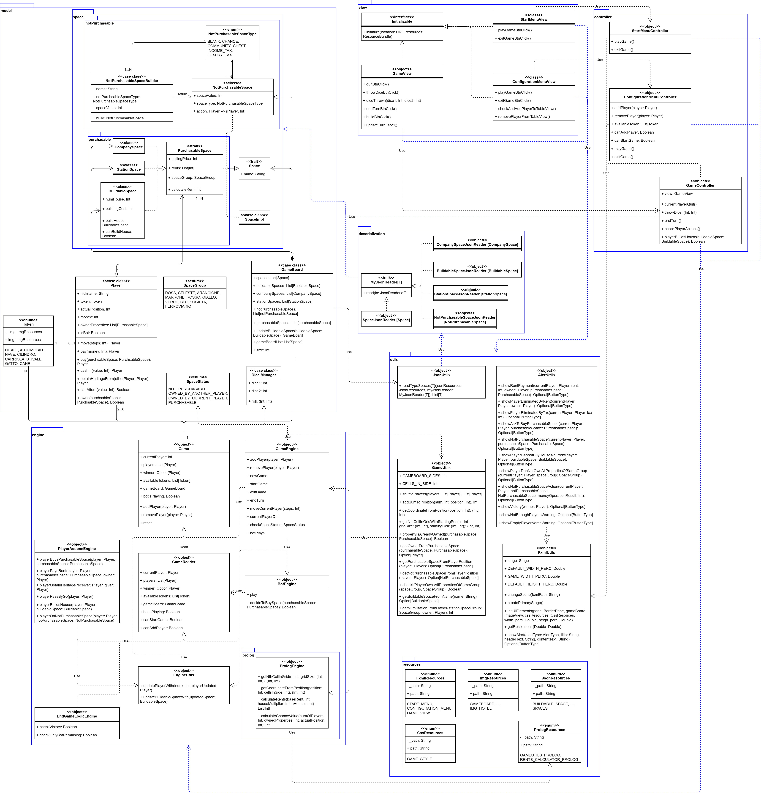

# Design di dettaglio

Come detto nel capitolo precedente le componenti del sistema sono state suddivise in vari moduli; oltre a quelli già citati (alcuni dei quali sono stati a loro volta divisi in sotto-moduli) sono presenti 2 ulteriori package, uno per la deserializzazione di file json contenenti informazioni delle varie caselle del tabellone di gioco, e uno contenente vari oggetti di utility. 

Nella figura sottostante viene mostrata la gerarchia con cui sono stati organizzati i vari moduli del progetto.

  

## Diagramma delle Classi
Nella figura sottostante è riportato il diagramma delle classi. I rettangoli blu indicano i vari moduli e sotto-moduli.

  

Viene ora analizzato ogni singolo modulo.

## Model
In figura viene mostrato il modulo `Model` con i relativi sotto-moduli, `Space`, `NotPurchasable` e `Purchasable`.

  

### Space

#### NotPurchasable

#### Purchasable

## View

  

## Controller

  

## Engine

  

## Utils

  

## Deserialization

  

[Indietro](../4-architectural-design/README.md) | [Torna alla Home](../README.md) | [Vai a Implementazione](../6-implementation/README.md)
