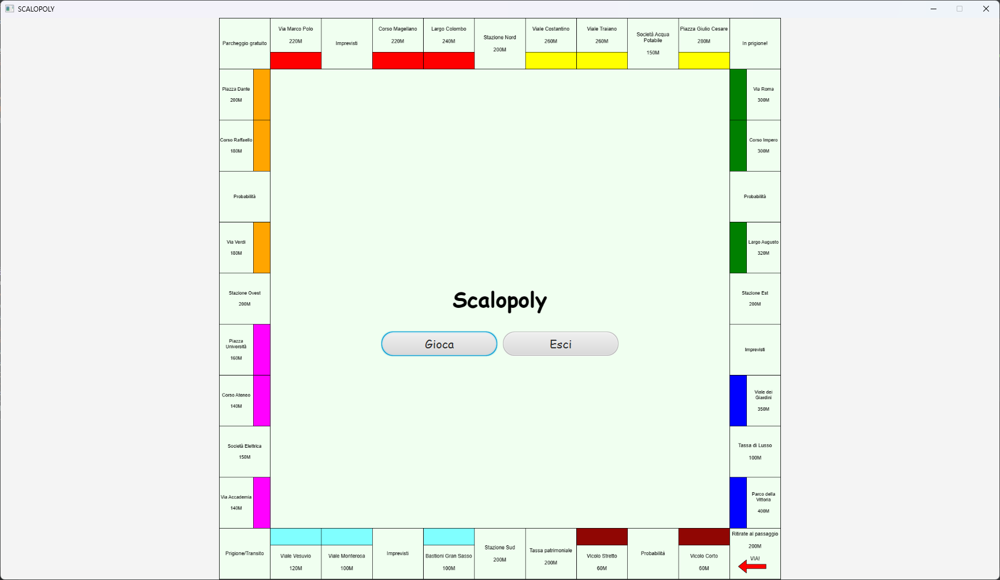
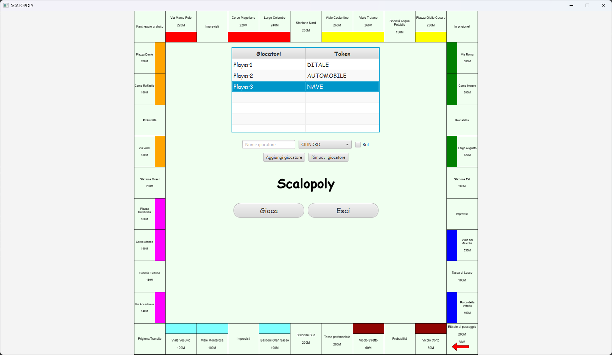
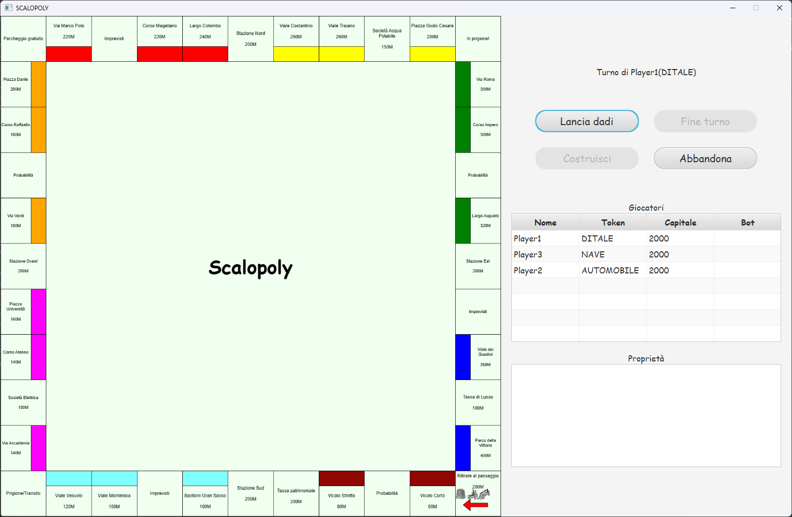
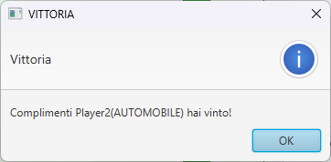

# Implementazione

## Schermate di gioco
### Start Menu
Modellata dalla classe `StartMenuView`, rappresenta la pagina iniziale ed è controllata dal `StartMenuController`.
<p align="center">    </p>

### Configuration Menu
Modellata dalla classe `ConfigurationMenuView`, rappresenta la pagina di configurazione ed aggiunta dei giocatori ed è controllata dal `ConfigurationMenuController`.
<p align="center">    </p>

### Game View
Modellata dalla classe `GameView`, rappresenta il tabellone principale del gioco  ed è controllata dal `GameController`.
<p align="center">    </p>

### Victory View
È un semplice alert che viene mostrato quando un giocatore vince la partita. Altri alert simili sono stati implementati per notificare l'utente di diversi eventi durante la partita.
<p align="center">    </p>

# Suddivisione del lavoro
Ogni componente fornirà una descrizione delle parti di cui è responsabile.

## Pair Programming (Negri, Zammarchi)  
Le classi a cui i due componenti hanno interamente lavorato insieme sono le seguenti, raggruppate per package:
- *Controller*:
  - `GameController`
- *Engine*`:
  - *Prolog*:
    - `PrologEngine`
  - `GameEngine`
  - `PlayerActionEngine`
- *Model*:
  - *Space*:
    - *Purchasable*:
        - `BuildableSpace`
        - `CompanySpace`
        - `PurchasableSpace`
        - `StationSpace`
    - `Space`
    - `SpaceImpl`
  - `Player`
  - `Token`
- *Utils*:
  - `FxmlUtils`
  - `GameUtils`
- *View*:
  - `GameView`

## Michele Laddaga
Le classi dove ho singolarmente lavorato maggiormente (interamente o in parte) sono le seguenti, raggruppate per package:
- *Controller*:
  - `ConfigurationMenuController`
  - `StartMenuController`
- *Engine*`:
  - *Prolog*:
    - `PrologEngine`
- *Model*:
  - *Space*:
    - *NotPurchasable*:
      - `NotPurchasableSpace`
      - `NotPurchasableSpaceBuilder`
      - `NotPurchasableSpaceType`
- *Utils*:
  - `GameUtils`
- *View*:
  - `ConfigurationMenuView`
  - `StartMenuView`

Tra i vari sviluppi effettuati riporto qualche punto di interesse che ha portato ad alcune riflessioni sull'utilizzo delle tecnologie scelte e sull'analisi iniziale effettuata.
Prima di tutto vorrei riportare come lo sviluppo Test Driven inizialmente abbia rallentato, almeno per quanto mi riguarda, il processo implementativo. Questo però è diventato essenziale nelle parti successive, soprattutto di refactor, per evitare di introdurre bug o problemi vari (come nell'esempio che riporto in seguito).
Come primo punto vorrei riportare come, a posteriori, la scelta della tecnologia JavaFX in un progetto in SCALA, mi abbia messo di fronte a molte lacunee nella documentazione online a riguardo. Lo stesso discorso l'ho riscontrato analizzando le soluzione messe a disposizione da SCALAFX il quale, per lo meno per gli esempi verificati, risulta anch'esso acerbo e non paragonabile ad alternative similari che si possono trovare ad esempio in altri linguaggi.
Come seconda analisi riporto un evento verificatosi durante il processo di sviluppo quando il refactoring di una parte del modello, nello specifico delle celle non acquistabili, è stato necessario una volta analizzato il codice che era stato prodotto: questo è successo poichè una mia analisi iniziale non precisa ha portato alla creazione di vari classi che ereditavano dal trait NotPurchasableSpace con la conseguenza di avere molto codice ripetuto.
Applicando quindi il principio DRY è stato unito tutto il codice ridondante andando a trasformare quello che inizialmente era un trait in una classe parametrica che ora va a prendere in ingresso l'azione che definirà poi a runtime il comportamento della stessa cella al passaggio degli utenti. Dopo di che è stato necessario creare un Builder che andasse a inizializzare e specializzare le varie celle in base all'azione di interesse.
Come anticipato all'inizio, in questa fase lo sviluppo Test Driven si è rivelato molto utile permettendo di procedere senza introdurre problematiche di nessun genere.
Come ultima annotazione riporto l'implementazione di un esempio in Prolog per il calcolo di un valore utilizzato per definire il comportamento delle celle di probabilità: tali celle, per semplicità nel progetto proposto, portano l'utente a pagare o a riscuotere una determinata cifra in base al valore restituito dalla regola definita in prolog. Tale implementazione di esempio potrà essere facilmente espansa andando a modificare le regole del file app/src/main/resources/prolog/ChanceCalculatorProlog.pl.

## Andrea Negri
Le classi dove ho singolarmente lavorato maggiormente, oltre a quelle già elencate nella parte di Pair Programming, sono le seguenti, raggruppate per package:
- *Engine*:
  - `EndgameLogicEngine`
  - `EngineUtils`
- *Utils*:
  - `AlertUtils`


## Andrea Zammarchi
Le classi a cui ho contribuito, in totalità (oltre a quelle già elencate nel Pair Programming), sono le seguenti, raggruppate per package:

- *Deserialization*:
  - `BuildableSpaceJsonReader`
  - `CompanySpaceJsonReader`
  - `MyJsonReader`
  - `NotPurchasableSpaceJsonReader`
  - `SpacesJsonReader`
  - `StationSpaceJsonReader`
- *Engine*:
  - `BotEngine`
  - `Game`
- *Model*:
  - `DiceManager`
  - `GameBoard`
  - `SpaceGroup`
  - `SpaceStatus`

Successivamente, fornirò una descrizione dettagliata delle sezioni più rilevanti del mio contributo a questo progetto, escludendo le parti già trattate nei capitoli precedenti.

### Deserialization
In questa sezione, ho implementato le classi necessarie per la deserializzazione dei file JSON contenenti le informazioni relative alle proprietà, acquistabili e non. In particolare, ho dichiarato un *Trait* `MyJsonReader` che contiene il metodo `read`, comune a tutte le classi che si occupano della deserializzazione di un file JSON. Inoltre, ho implementato le classi concrete che si occupano della deserializzazione dei file JSON contenenti le informazioni relative alle proprietà acquistabili dove si possono costruire case/hotel (`BuildableSpaceJsonReader`), alle stazioni (`StationSpaceJsonReader`), alle società (`CompanySpaceJsonReader`), alle proprietà non acquistabili (`NotPurchasableSpaceJsonReader`), e infine alle proprietà in generale (`SpacesJsonReader`), che contiene semplicemente un elenco di nomi che rappresenta la sequenza delle caselle sul tabellone.

Il motivo principale per cui ho deciso di ricorrere ai file Json è la possibilità di non dover modificare il codice sorgente per aggiungere nuove proprietà al gioco, o per modificare quelle esistenti.

### BotEngine
L'*object* `BotEngine` si occupa di gestire il comportamento dei bot. In particolare, contiene un metodo `play` che, una volta richiamato dal `GameEngine`, verifica quali sono le azioni che il bot può compiere e ne sceglie una.

Il suo comportamento è basilare e non è stato implementato in modo particolarmente sofisticato (ad esempio tramite *AI*), in quanto il suo scopo è quello di fornire un'implementazione di base per il comportamento dei bot, che può essere migliorata in futuro.

In particolare, come prima cosa verifica se può lanciare i dadi (e li lancia in caso affermativo), dopodichè se capita su una proprietà acquistabile e non posseduta, la acquista se può permettersela. Se invece capita su una proprietà acquistabile e posseduta da un altro giocatore, paga l'affitto. Se capita su una proprietà non acquistabile, verifica se può pagare una tassa o riscuotere una ricompensa, e in caso affermativo lo fa. Infine, verifica se ha ottenuto un numero doppio dei dadi, in caso affermativo ripete il turno, altrimenti passa il turno al giocatore successivo.

### Gameboard
La `Gameboard` è la classe che si occupa di gestire il tabellone di gioco. In particolare, è una *case class* con un *companion object* che, ogni volta che viene avviata una nuova partita, viene creata una nuova istanza di questa classe, la quale legge i vari `Space` dai file Json e ne memorizza i vari elenchi, base al tipo. In questo modo, i valori dei file Json vengono letti solo una volta e non ogni volta che si vuole accedere a una proprietà del tabellone, ottimizzando le prestazioni del gioco.

### DiceManager, SpaceGroup e SpaceStatus
Il `DiceManager` è un semplice *object* che si occupa di lanciare i dadi. In particolare, contiene un metodo `roll` che restituisce un `Tuple2` contenente i due valori dei dadi.

`SpaceGroup` è un *enum* che contiene i vari gruppi di proprietà acquistabili, e viene utilizzato per determinare se un giocatore possiede tutte le proprietà di un determinato gruppo.

`SpaceStatus` è anch'esso un *enum* che contiene i vari stati in cui può trovarsi una proprietà acquistabile. In particolare, può essere acquistabile, acquistata dal giocatore attuale, posseduta da un altro giocatore, oppure non acquistabile.

### Prolog
Per quanto riguarda la mia parte sviluppata in **Prolog**, ho contribuito allo sviluppo del `PrologEngine`. In particolare, il metodo `calculateRents` si occupa di calcolare i valori degli affitti di una proprietà acquistabile, in base al numero di case costruite, al numero di stazioni possedute, e al numero di società possedute. In output restituisce una `List(Int)` contenente tutti i possibili valori calcolati e li passa alla `Gameboard`, in fase di creazione di una partita, che li memorizza nelle varie liste di `Space`.

#### Teoria
```prolog
% B -> Base rent
% R -> Rent multiplier
% N -> Number of houses/stations/companies
% [T|Rest] -> List of possible rents
rents(B, _, 0, [B]).
rents(B, R, N, [T|Rest]) :- 
  N > 0, N1 is N - 1, 
  rents(B, R, N1, Rest), 
  T is R * N + B,
  !.
```

#### Possibile Goal
```prolog
% Calculate rents for a property with 10 base rent and 50 rent multiplier, with 5 possible houses
rents(10, 50, 5, R).
```

Come risultato ottengo la lista di affitti in caso di proprietà con 0..4 case costruite (la quinta casa equivale ad un hotel).

### Repository
In fase di creazione del repository mi sono occupato dei seguenti task:
- configurazione della **build automation** con *Gradle*;
- configurazione del **licensing** in modo da utilizzare la licenza *MIT*;
- creazione workflow di **continuous integration** con *GitHub Actions*;
- configurazione della **code coverage** con *JaCoCo*;
- configurazione della **code quality** con *ScalaFMT* e *Wart Remover*.

### TDD
Per questo progetto, mi sono imposto di utilizzare la metodologia *TDD* (Test Driven Development), in modo da scrivere i test prima di scrivere il codice sorgente. Ciò mi ha permesso di avere una maggiore consapevolezza del codice che stavo scrivendo, di avere una maggiore sicurezza che il codice funzionasse correttamente e di ridurre notevolmente il debito tecnico (prevenendo bug) per modifiche avvenute in seguito.

[Indietro](../5-detailed-design/README.md) | [Torna alla Home](../README.md) | [Vai a Conclusioni](../7-conclusion/README.md)
